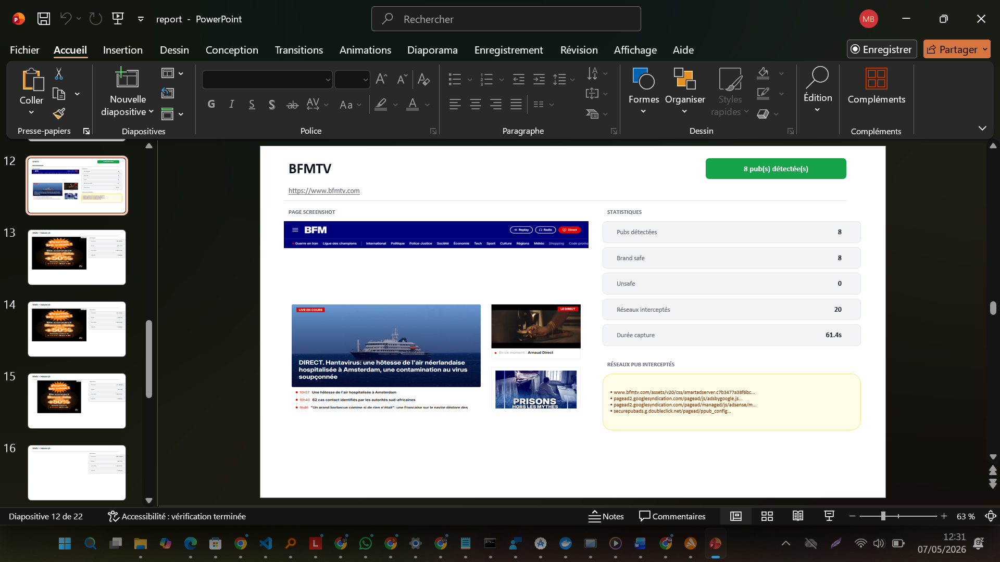
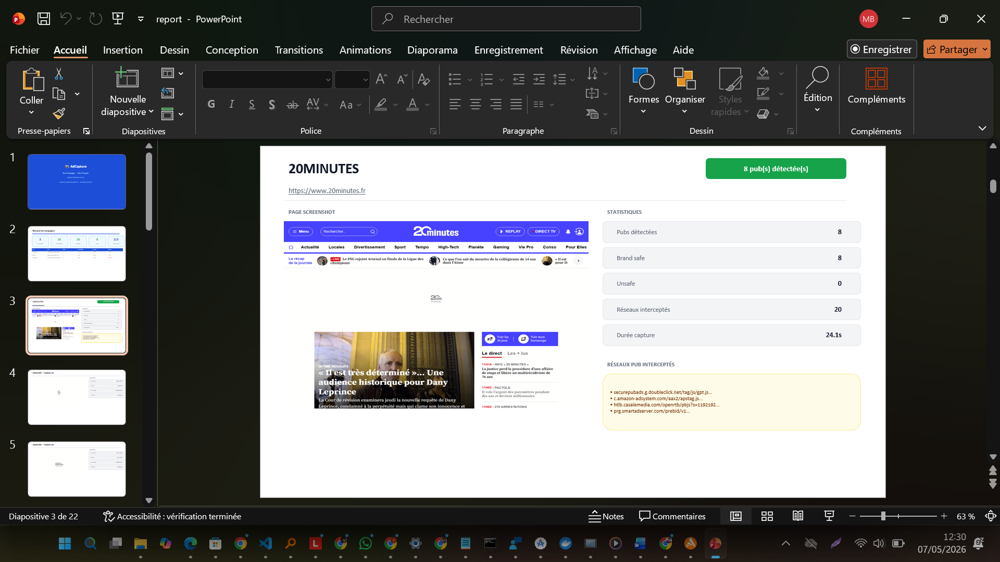
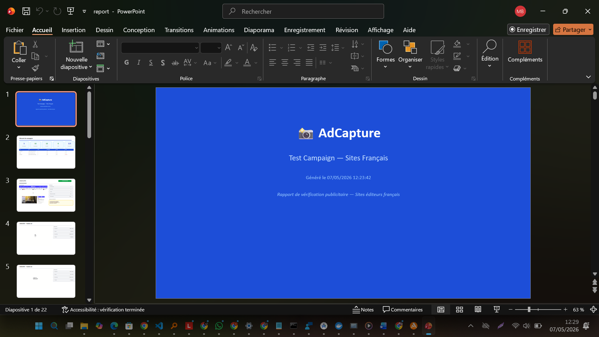
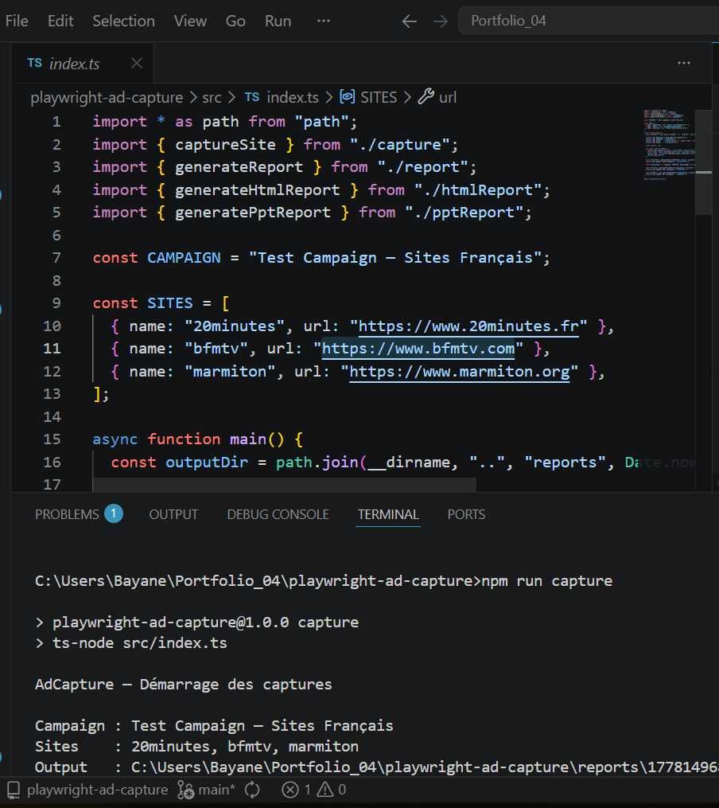

# playwright-ad-capture

> Headless ad verification tool — détecte et capture automatiquement les publicités sur les sites éditeurs français, génère des rapports JSON + HTML visuel + **PowerPoint 22 slides** avec screenshots et analyse brand safety.

Built with **Playwright** + **TypeScript** + **Node.js** + **pptxgenjs**

---

## Screenshots






---

## Fonctionnalités

- Navigation headless sur les sites éditeurs (Chromium via Playwright)
- Détection automatique des emplacements publicitaires (iframes, GPT, Smart AdServer, Xandr, DoubleClick, etc.)
- Interception des requêtes réseau vers 17+ ad networks (DoubleClick, Criteo, Taboola, Amazon Ads...)
- Scroll automatique pour déclencher les pubs lazy-loadées
- Gestion des bandeaux cookie (clic automatique — Didomi + génériques)
- Screenshot de chaque publicité détectée (clip page) + screenshot full page
- Analyse brand safety (détection mots-clés non conformes)
- Vérification taille IAB standard (300x250, 728x90, 970x250, etc.)
- **Génération automatique de 3 rapports** : JSON + HTML visuel + PowerPoint 22 slides

---

## Stack

- **Playwright** (Chromium headless)
- **TypeScript** / **Node.js**
- **pptxgenjs** — génération PowerPoint côté serveur
- **ts-node** pour l'exécution directe

---

## Installation

```bash
git clone https://github.com/Bayane-max219/playwright-ad-capture
cd playwright-ad-capture
npm install
npx playwright install chromium
```

## Utilisation

```bash
npm run capture
```

Le script ouvre chaque site en headless, clique le cookie banner, scroll, détecte les pubs, capture les screenshots et génère automatiquement les rapports dans `reports/<timestamp>/`.

---

## Rapports générés automatiquement

| Fichier | Format | Contenu |
|---|---|---|
| `report.json` | JSON | Données brutes campagne + sites + pubs |
| `report.html` | HTML | Rapport visuel standalone avec screenshots |
| `report.pptx` | PowerPoint | 22 slides : titre, résumé, par site, par pub, finale |

### Structure PPT (22 slides)
- **Slide 1** — Titre campagne
- **Slide 2** — Résumé : tableau récapitulatif + 5 métriques clés
- **Slide par site** — Screenshot page + statistiques + réseaux interceptés
- **Slide par pub** — Screenshot pub + dimensions + brand safety + IAB size
- **Slide finale** — Signature

---

## Exemple de sortie console

```
AdCapture — Démarrage des captures

Campaign : Test Campaign — Sites Français
Sites    : 20minutes, bfmtv, marmiton

Capture en cours : 20minutes (https://www.20minutes.fr)
  → 7 pub(s) détectée(s) en 27291ms
Capture en cours : bfmtv (https://www.bfmtv.com)
  → 3 pub(s) détectée(s) en 17054ms
Capture en cours : marmiton (https://www.marmiton.org)
  [réseau] 724 requête(s) pub interceptée(s) sur marmiton
  → 0 pub(s) détectée(s) en 21150ms

========================================
  CAMPAIGN: Test Campaign — Sites Français
  Total sites  : 3
  Total ads    : 10
----------------------------------------

  [OK] 20minutes
     Ads found : 7
     Brand safe: 7 / Unsafe: 0
     Duration  : 27291ms
     → 984x250 @ (148,250)  | safe:true
     → 320x700 @ (832,1253) | safe:true

  [OK] bfmtv
     Ads found : 3
     Brand safe: 3 / Unsafe: 0

  [NO ADS] marmiton
     Ads found : 0 (724 ad network requests intercepted)

Rapport JSON sauvegardé : reports/1778149689583/report.json
Rapport HTML sauvegardé : reports/1778149689583/report.html
Rapport PPT sauvegardé  : reports/1778149689583/report.pptx
```

---

## Structure du projet

```
playwright-ad-capture/
├── src/
│   ├── index.ts        # Point d'entrée — liste des sites à capturer
│   ├── capture.ts      # Moteur Playwright — navigation, détection, screenshot
│   ├── report.ts       # Génération rapport JSON + affichage console
│   ├── htmlReport.ts   # Génération rapport HTML visuel
│   ├── pptReport.ts    # Génération rapport PowerPoint (22 slides)
│   └── types.ts        # Interfaces TypeScript
├── screenshoots/       # Screenshots du projet
├── reports/            # Rapports générés (gitignored)
├── tsconfig.json
└── package.json
```

---

## Cas d'usage réels

- **Agences média** : prouver visuellement la diffusion d'une campagne
- **Annonceurs** : vérifier le brand safety des emplacements achetés
- **Régies** : générer des PPT de mise en ligne automatiquement
- **Ad verification** : détecter les emplacements non conformes et les réseaux publicitaires

---

Développé par **Bayane Miguel Singcol** · 2026
